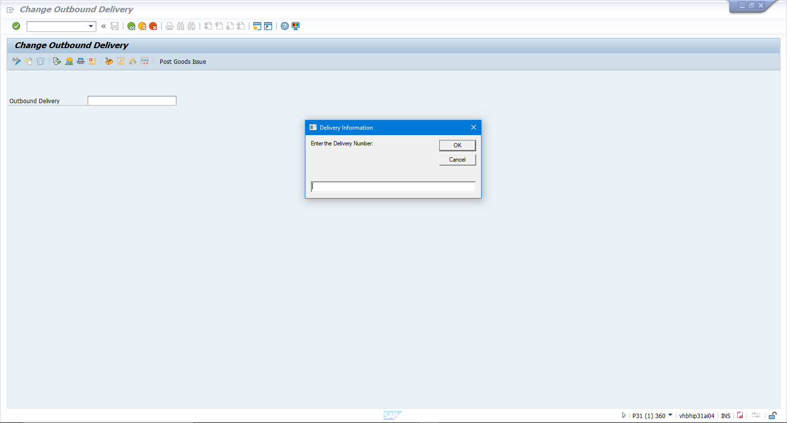

# SAP Outbound Shipping Automation Tool

  

## Project Overview
This tool is a robust **Business Process Automation (BPA)** solution designed to streamline outbound shipping operations within **SAP GUI**. Written in **VBScript**, it interacts directly with the SAP Scripting API to automate repetitive data entry, document generation, and handling unit creation.

The tool employs a **Human-in-the-Loop (HITL)** architecture: it handles the high-volume, repetitive "grunt work" of SAP navigation and data entry, but returns control to the analyst for the final critical validation (BOL and PGI), reducing processing time while maintaining data integrity.

## Key Features

### 1. Dynamic Workflow Logic
The script adapts its execution path based on user input, handling three distinct operational scenarios:
* **Full Documentation:** Checks for existing invoices, offers to reprint or generate new ones, and creates packing lists.
* **Packing List Only:** Skips financial document generation when only logistical documents are needed.
* **BOL Only:** Automates the packing process but skips all printing services for specific freight scenarios.

### 2. Enterprise-Grade Error Handling & Resilience
Unlike simple linear scripts, this tool is built for production stability:
* **Connection Healing:** Automatically detects dropped SAP sessions and attempts to reconnect or refresh the transaction to prevent crashes.
* **Memory Management:** Includes a garbage collection subroutine to release resources, preventing the memory leaks common in long-running SAP GUI sessions.
* **Pop-up Handling:** Automatically detects and dismisses nuisance pop-ups (e.g., Serial Number or Country of Origin warnings) by reading the SAP status bar.

### 3. Smart Data Validation
* **Plant Logic:** Automatically determines the correct SAP Output Type (e.g., `ZPL0` vs `YPLA`) based on the user's plant selection.
* **Input Validation:** Prevents downstream SAP errors by validating delivery numbers and dimensions before the automation sequence begins.

## Technical Implementation
* **Language:** VBScript (Windows Script Host)
* **Integration:** SAP GUI Scripting API
* **Key Methods:** `FindById`, `GetScriptingEngine`, `FileSystemObject`

## How It Works
1.  **Data Collection:** The user inputs the Delivery Number, Weights, Dims, and Document Counts via a GUI prompt.
2.  **Decision Engine:** The script determines the correct routing (New Invoice, Reprint, or Pack Only).
3.  **Execution:**
    * Navigates to Transaction `VL02N` (Change Outbound Delivery).
    * Packs materials into Handling Units (HU) with precise weight/dim data.
    * Triggers output generation for Packing Lists and Commercial Invoices.
    * Exports PDFs to a local OneDrive directory using the SAP Generic Object Services (GOS).
4.  **Handoff:** The script terminates at the Shipment Header tab, allowing the analyst to attach the signed BOL and finalize the Post Goods Issue (PGI).

## Disclaimer
This script is a portfolio demonstration of SAP automation techniques. It is designed for a specific SAP environment configuration and would require adaptation for use in other enterprise systems.
